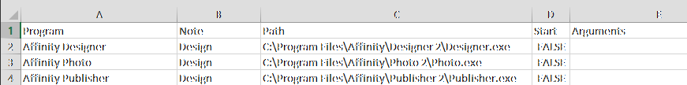

# UiPath-Program-Start-Up-Bot

This bot starts up programs on a computer.  I use it to setup different programs groups.  For example a programming set and a study set.

### Getting Started

After making a pull request or downloading the project, open the Main.xaml in UiPath Studio.  The robot can be run with the play button in the ribbon and the result can be seen in output panel.

### Details

1. Populate the paths for the applications in `Data\Input\Input.xlsx`.  I include some samples and they can be seen in this screenshot.

2. Set the `Start` cell to `TRUE`.  The bot only considers records where the start cell is set to `TRUE`.
3. Run the bot in UiPath Studio.

## Additional Notes
This bot can be published to Orchestrator and run with UiPaht Assistant if desired.

### Architecture Requirements

A standard UiPath, Studio to Orchestrator cloud setup is the base of operation.  It is easy to setup and free.
1. An Orchestrator connection - Visit https://cloud.uipath.com/ and authenticate or sign up.
2. [UiPath Studio](https://www.uipath.com/product/studio) is used to run the robot.  Note that Studio Web can be used directly in Orchestrator but I recommend installing the Studio IDE application.

[](https://github.com/ShonHarsh/UiPath-SetupGuide)

### Git Notes

Clone the project to develop or change it.

```sh
git clone https://github.com/ShonHarsh/UiPath-Program-Start-Up-Bot
```

### Links
- [UiPath Automation Platform](https://www.uipath.com/)
- [UiPath Studio](https://www.uipath.com/product/studio)
- [Pulsar](https://pulsar-edit.dev/) (Atom Successor) - Used for all my README.md files
- [Shon Harsh Website 127.0.0.1](https://shonharsh.github.io/curriculum-vitae/index.html)
- [This.GitHub](https://github.com/shonharsh)
- [LinkedIn](https://www.linkedin.com/in/shonharsh/)
